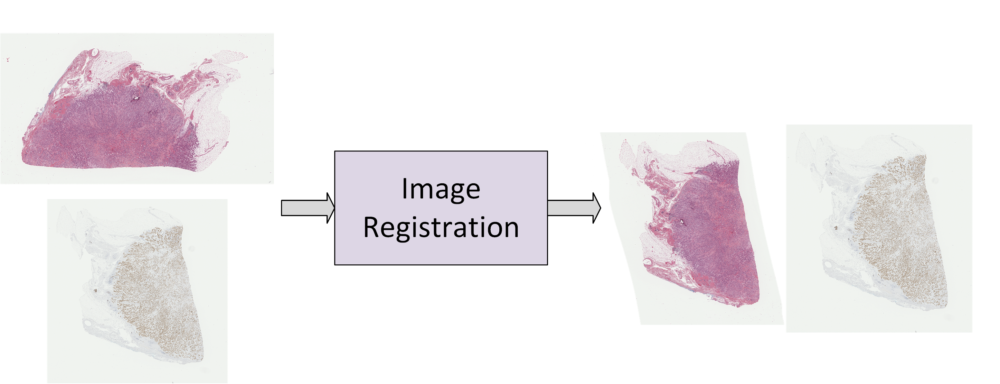

# DeeperHistReg - Robust Whole Slide Images Registration Framework

<!--  -->
<p align="center">
  
</p>
<!--  -->
<!--  -->
<p align="center">
  
</p>
<!--  -->

The repository containts the source code the the DeeperHistReg library together with usage examples.

The library is dedicated to performing an automatic and robust affine/deformable registration of microscopy images, either WSIs acquired with different stains or images fluorescence microscopy. 

* The library was tested on the following stains / types of images acquired by various equipment:
    * H&E
    * ER
    * PGR
    * HER2
    * KI67
    * CC10
    * CD8
    * CD31
    * CD45
    * PR
    * PHH3
    * DAPI

The highest tested resolution was close to 220k x 220k pixels.

Methods available in the library won the ACROBAT 2023 challenge organized during the MICCAI conference and are among the best performing ones according to several benchmarks [Article](TODO).

# Installation

```
pip install deeperhistreg
```

Or clone the repository and install directly.

You can also run the registration using Docker (see below).

In case you decide to clone the repository and install directly - please download the "dhr_models" and copy it to the deeperhistreg folder (due to large file sizes): [Models](https://drive.google.com/drive/folders/1yQyz-F0mTjFvSeO0JddLlYA_97ru6-Lv?usp=sharing). This step is not required if installed via pip.

# Examples

## Affine Registration

```python
import deeperhistreg

def run():
    ### Define Inputs/Outputs ###
    source_path : Union[str, pathlib.Path] = None # Path to the source image
    target_path : Union[str, pathlib.Path] = None # Path to the target image
    output_path : Union[str, pathlib.Path] = None # Path to the destination directory

    ### Define Params ###
    registration_params : dict = deeperhistreg.configs.default_affine()
    # Alternative: # registration_params = deeperhistreg.configs.load_parameters(config_path) # To load config from JSON file
    save_displacement_field : bool = True # Whether to save the displacement field (e.g. for further landmarks/segmentation warping)
    copy_target : bool = True # Whether to copy the target (e.g. to simplify the further analysis)
    delete_temporary_results : bool = True # Whether to keep the temporary results
    case_name : str = "Example_Affine" # Used only if the temporary_path is important, otherwise - provide whatever
    temporary_path : Union[str, pathlib.Path] = None # Will use default if set to None

    ### Create Config ###
    config = dict()
    config['source_path'] = source_path
    config['target_path'] = target_path
    config['output_path'] = output_path
    config['registration_parameters'] = registration_params
    config['case_name'] = case_name
    config['save_displacement_field'] = save_displacement_field
    config['copy_target'] = copy_target
    config['delete_temporary_results'] = delete_temporary_results
    config['temporary_path'] = temporary_path
    
    ### Run Registration ###
    deeperhistreg.run_registration(**config)

if __name__ == "__main__":
    run()
```

Please find the example here: [Affine Registration](./deeperhistreg_examples/affine_registration.py).

## Deformable Registration

```python
import deeperhistreg

def run():
    ### Define Inputs/Outputs ###
    source_path : Union[str, pathlib.Path] = None # Path to the source image
    target_path : Union[str, pathlib.Path] = None # Path to the target image
    output_path : Union[str, pathlib.Path] = None # Path to the destination directory

    ### Define Params ###
    registration_params : dict = deeperhistreg.configs.default_initial_nonrigid()
    # Alternative: # registration_params = deeperhistreg.configs.load_parameters(config_path) # To load config from JSON file
    save_displacement_field : bool = True # Whether to save the displacement field (e.g. for further landmarks/segmentation warping)
    copy_target : bool = True # Whether to copy the target (e.g. to simplify the further analysis)
    delete_temporary_results : bool = True # Whether to keep the temporary results
    case_name : str = "Example_Nonrigid" # Used only if the temporary_path is important, otherwise - provide whatever
    temporary_path : Union[str, pathlib.Path] = None # Will use default if set to None

    ### Create Config ###
    config = dict()
    config['source_path'] = source_path
    config['target_path'] = target_path
    config['output_path'] = output_path
    config['registration_parameters'] = registration_params
    config['case_name'] = case_name
    config['save_displacement_field'] = save_displacement_field
    config['copy_target'] = copy_target
    config['delete_temporary_results'] = delete_temporary_results
    config['temporary_path'] = temporary_path
    
    ### Run Registration ###
    deeperhistreg.run_registration(**config)

if __name__ == "__main__":
    run()
```

Please find the example here: [Deformable Registration](./deeperhistreg_examples/nonrigid_registration.py).

## Apply Deformation

```python
    ### Run Registration ###
    deeperhistreg.run_registration(**config)

    ### Apply Warping ###
    source_image_path = source_path # Here the same as during the registration - can be replaced with path to the binary mask
    target_image_path = target_path # Here the same as during the registration - serves as a template
    warped_image_path = None  # Where to save the warped image
    displacement_field_path = pathlib.Path(output_path) / "displacement_field.mha"
    loader = deeperhistreg.loaders.OpenSlideLoader # Which backend should be used to load the slide
    saver = deeperhistreg.savers.TIFFSaver # What is the desired format of the output
    save_params = deeperhistreg.savers.tiff_saver.default_params
    level = 0 # Pyramid level to perform the warping - 0 is the highest possible
    pad_value = 255 # White in the RGB representation
    save_source_only = True # Whether to save only the warped image or also the corresponding target image
    to_template_shape = True # Whether to align the source shape to template shape (if initially different)
    to_save_target_path = None # Path where to save the target (if save_source_only set to False)

    deeperhistreg.apply_deformation(
        source_image_path = source_image_path,
        target_image_path = target_image_path,
        warped_image_path = warped_image_path, 
        displacement_field_path = displacement_field_path,
        loader = loader,
        saver = saver,
        save_params = save_params,
        level = level,
        pad_value = pad_value,
        save_source_only = save_source_only,
        to_template_shape = to_template_shape,
        to_save_target_path = to_save_target_path
    )

```

Please find the example here: [Apply Deformation](./deeperhistreg_examples/apply_deformation.py).

## Jupyter Notebook

Please find the example here: [Jupyter Notebook](./deeperhistreg_examples/example_notebook.ipynb).

## Docker Usage

You can download the Docker container here: [Docker](TODO).

The usage is as follows:

```bash
#!/bin/bash
: '
This example shows how to use the the DeeperHistReg library using the Docker container (single registration).
You can use the provided image or build it by yourself.
To build the docker directly use: docker build --tag image_name . <- where image_name is the desired name.
'
IMAGE_NAME=deeperhistreg # The container name

SOURCE_PATH=/source_path  # Full path to the source image
TARGET_PATH=/target_path # Full path to the target image
PARAMS=/path_to_json_params.json # Full path to the registration config (see deeperhistreg_params) - Defaults to default_nonrigid.json
SAVE_PATH=/save_directory # Full path to the directory that will contain the results (will be created if does not exists)
CASE_NAME=Example # Name for the given registration pair
TEMP_DIR=/temporary_directory # Temporary results - contain intermediate registration steps (defaults to reasonable value)
# --sdf - Whether to save the displacement field (e.g. for further landmarks warping or segmentation transfer)
# --cpt - Whether to copy the target to the output folder (to simplify further analysis)
# --dtmp - Whether to delete the temporary results (presenting preprocessing, initial alignement, nonrigid registration - makes sense for Docker)

docker run --gpus all -v $SOURCE_PATH:$SOURCE_PATH -v $TARGET_PATH:$TARGET_PATH -v $PARAMS:$PARAMS -v $SAVE_PATH:$SAVE_PATH $IMAGE_NAME \
 --srcp $SOURCE_PATH --trgp $TARGET_PATH --out $SAVE_PATH --params $PARAMS --exp $CASE_NAME --temp $TEMP_DIR --sdf --cpt --dtmp
```

Please find the example here: [Docker_Example](./deeperhistreg_examples/run_registration_docker.sh).

# Configuration Files

There are several configuration files available either as a dictionary (when using as a library) or JSON file (when using the Docker).

* Available configuration files:
    * Initial Alignment:
        * [Initial Alignment Config - JSON](./deeperhistreg_params/default_initial.json)
        * [Initial Alignment Config - Dictionary](./deeperhistreg/dhr_pipeline/registration_params.py#L74)
    * Initial Alignment Fast:
        * [Initial Alignment Fast Config - JSON](./deeperhistreg_params/default_initial_fast.json)
        * [Initial Alignment Fast Config - Dictionary](./deeperhistreg/dhr_pipeline/registration_params.py#L145)
    * Deformable Registration:
        * [Deformable Registration - JSON](./deeperhistreg_params/default_nonrigid.json)
        * [Deformable Registration - Dictionary](./deeperhistreg/dhr_pipeline/registration_params.py#L235)
    * Deformable Registration Fast:
        * [Deformable Registration Fast - JSON](./deeperhistreg_params/default_nonrigid_fast.json)
        * [Deformable Registration Fast - Dictionary](./deeperhistreg/dhr_pipeline/registration_params.py#L305)
    * Deformable Registration High Resolution:
        * [Deformable Registration High Resolution - JSON](./deeperhistreg_params/default_nonrigid_high_resolution.json)
        * [Deformable Registration High Resolution - Dictionary](./deeperhistreg/dhr_pipeline/registration_params.py#L375)
    * Initial Alignment + Deformable Registration: 
        * [Initial Alignment + Deformable Registration - JSON](./deeperhistreg_params/default_initial_nonrigid.json)
        * [Initial Alignment + Deformable Registration - Dictionary](./deeperhistreg/dhr_pipeline/registration_params.py#L484)
    * Initial Alignment + Deformable Registration Fast:
        * [Initial Alignment + Deformable Registration Fast - JSON](./deeperhistreg_params/default_initial_nonrigid_fast.json)
        * [Initial Alignment + Deformable Registration Fast - Dictionary](./deeperhistreg/dhr_pipeline/registration_params.py#L568)
    * Initial Alignment + Deformable Registration High Resolution:
        * [Initial Alignment + Deformable Registration High Resolution - JSON](./deeperhistreg_params/default_initial_nonrigid_high_resolution.json)
        * [Initial Alignment + Deformable Registration High Resolution - Dictionary](./deeperhistreg/dhr_pipeline/registration_params.py#L652)

# Supported formats

Currently the library supports all formats that can be loaded using:
* OpenSlide [OpenSlide](https://openslide.org/api/python/)
* PyVips [PyVips](https://libvips.github.io/pyvips/vimage.html)
* tifffile [tifffile](https://pypi.org/project/tifffile/)
* PIL - dedicated mainly to .jpg and .png, however still .tiff files are recommended rather than these formats for the high-resolution images

## How to change the requested format?

Simply modify the configuration in the following lines:
```python
    ### Loading Params ###
    loading_params = dict()
    loading_params['final_level'] = 0
    loading_params['pad_value'] = 255.0
    loading_params['loader'] = 'tiff' # <- modify the loader here (Supported: tiff, pil, vips, openslide, planned support for bioformats)
    loading_params['source_resample_ratio'] = 0.5
    loading_params['target_resample_ratio'] = 0.5
    params['loading_params'] = loading_params
```


# Requests

Are you searching for another functionality related to the registration of microscopic or other images? Isn't your format supported or the registration results are not satisfactory? You don't have the computational capabilities to run the library?

If so - I am open to research collaboration, do not hestiate to contact me: 
[wodzinski@agh.edu.pl](wodzinski@agh.edu.pl)

# License

We release the framework as is without warranty. The framework is licensed under CC-BY-SA.
However, please note that to use the the full funcionality (that does depend on external modules) you must follow the appropriate license related to a particular module. Important mentions:
* In case you use the SuperPoint: [LICENSE](https://github.com/magicleap/SuperPointPretrainedNetwork/blob/master/LICENSE) - NONCOMMERCIAL, RESEARCH USE ONLY
* In case you use the SuperGlue: [LICENSE](https://github.com/magicleap/SuperGluePretrainedNetwork/blob/master/LICENSE) - NONCOMMERCIAL, RESEARCH USE ONLY

# Publications

If you found the source code useful, please cite:
 * The description of the DeeperHistReg Library - [DeeperHistReg](TODO) - Will Be Available Soon
 * The articles discussing the implemented methods:
      * [Hybrid Deep Learning-based WSI Registration](TODO) - Will Be Available Soon
      * [DeepHistReg](https://www.sciencedirect.com/science/article/pii/S0169260720316321)

You may be also interested in:
* ACROBAT Challenge Paper: [ACROBAT](https://arxiv.org/abs/2305.18033)
* ANHIR Challenge Paper: [ANHIR](https://ieeexplore.ieee.org/document/9058666)
* HyReCo Dataset: [HyReCo](https://ieee-dataport.org/open-access/hyreco-hybrid-re-stained-and-consecutive-histological-serial-sections)

# Acknowledgements

This project has received funding from the Innovative Medicines Initiative 2 Joint Undertaking under grant agreement No 945358. This Joint Undertaking receives support from the European Union's Horizon 2020 research and innovation program and EFPIA, Belgium (www.imi.europe.eu).

We gratefully acknowledge Poland’s high-performance computing infrastructure PLGrid (HPC Centers: ACK Cyfronet AGH) for providing computer facilities and support within computational grant no. PLG/2023/016239.

